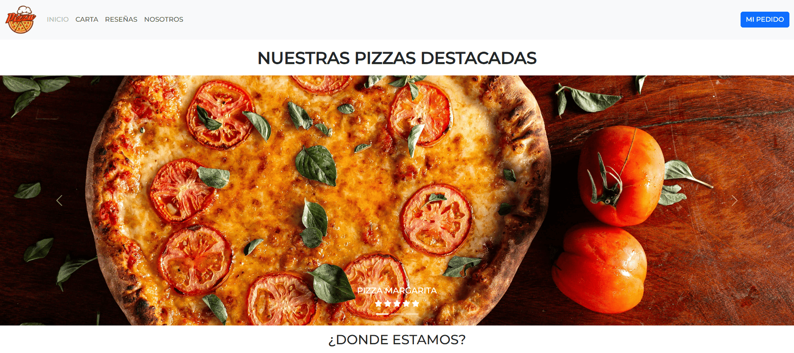

<h1 align="center">🍕Proyecto Web de Pizzería Online</h1>

  Proyecto web de una pizzería moderna. 
  <b>Menú, pedidos en línea y más.</b>

<h2>

<h2>🚀 Tecnologías</h2>
<ul>
  <li>HTML</li>
  <li>CSS (Sass)</li>
  <li>BOOTSTRAP</li>
</ul>

<h2>🛠️ Uso</h2>

  Esta es una web de una pizzería diseñada para pequeños negocios que buscan 
  <b>impulsar sus ventas</b> ofreciendo pedidos en línea de forma sencilla.  
  La página consta de <b>5 secciones principales</b> para facilitar la navegación de los usuarios:

<ul>
  <li><b>Inicio</b> – Presentación de la pizzería y promociones destacadas.</li>
  <li><b>Carta</b> – Menú completo con las pizzas disponibles.</li>
  <li><b>Reseñas</b> – Opiniones de clientes para generar confianza.</li>
  <li><b>Nosotros</b> – Historia y valores de la pizzería.</li>
  <li><b>Mi Pedido</b> – Carrito para realizar compras online.</li>
</ul>

  Gracias a esta estructura clara y simple, cualquier usuario puede navegar y realizar su pedido 
  de manera rápida, mejorando la experiencia del cliente y aumentando las ganancias del negocio.

<h2>🖼️ Captura</h2>

<h2>👨‍💻 Autor</h2>

  Alex Hartkopf  
  <a href="https://github.com/usuario">GitHub</a> •
  <a href="https://linkedin.com/in/usuario">LinkedIn</a>

